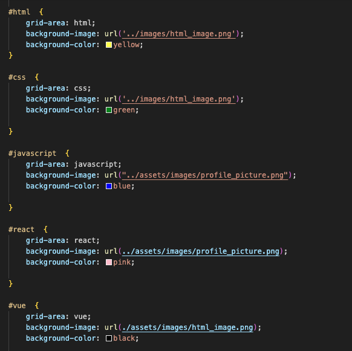
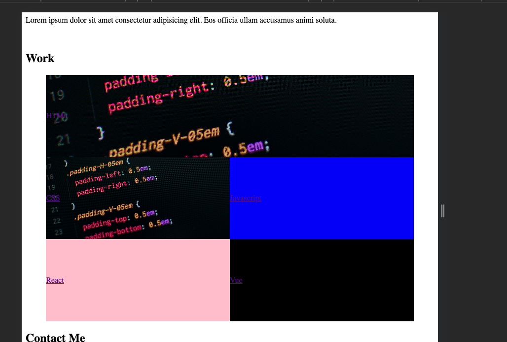

# Week-2-Challenge-Portfolio
Containing the full week's challenge including planning, code and revisions

This week, the challenge was to build a portfolio page, which can be added to as the course progresses. Theimportance of the portfolio is to showcase your skills and talents to employers looking to fill a part-time or full-time position.

I particularly struggled with getting images (shown below) to sit in the grid but later found out the main issue was my relative pathing was problematic. This is definitely something to practise more in the future.

